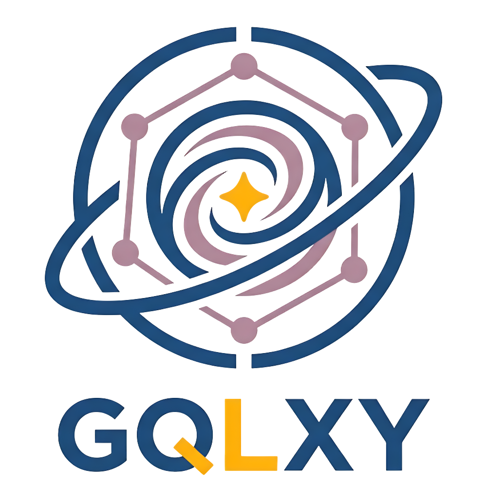

<div align="center">
  
</div>

An easy to use C++ GraphQL Client.

## Why
Alongside `gqlxy-server`, I wanted to build a GraphQL Client with few dependencies, based on Apollo Client's structure.

## What it is

`gqlxy-client` is a C++20 GraphQL client library modelled after Apollo Client. It provides a composable link chain for transport, an Apollo-style normalized `InMemoryCache`, fetch policies, and a coroutine-native `Observable` API, all without requiring a framework or runtime.

## Features

- **`Client`** — single entry point for `Query`, `Mutation`, `Subscribe`, and `Refetch`
- **`Observable<T>`** — supports both `co_await` (first value) and `.subscribe()` for streaming
- **`HttpLink`** — HTTP/HTTPS via Boost.Beast; detects `text/event-stream` and streams SSE subscriptions automatically
- **`WsLink`** — persistent WebSocket using the `graphql-transport-ws` protocol, with auto-reconnect and back-off
- **`SplitLink`** — routes requests between two links via a predicate (e.g. queries over HTTP, subscriptions over WS)
- **`InMemoryCache`** — thread-safe, normalised entity store with `__typename:id` keying and configurable type policies
- **Fetch policies** — `CacheFirst` (default), `NetworkOnly`, `CacheAndNetwork`, `NoCache`
- **Document transforms** — `AddTypename` applied by default; fully configurable via `ClientOptions::documentTransforms`
- **Custom links** — implement `Link::Execute()` to plug in any transport or middleware

## Getting started

Add GQLXY to your `vcpkg.json`:

```json
{ "dependencies": ["gqlxy-client"] }
```

```cmake
find_package(gqlxy-client CONFIG REQUIRED)
target_link_libraries(my_app PRIVATE gqlxy::client)
```

### Construct a client

```cpp
#include <gqlxy/client/client.h>
#include <gqlxy/client/links/http_link.h>
#include <gqlxy/client/links/ws_link.h>
#include <gqlxy/client/links/split_link.h>
#include <gqlxy/client/cache/in_memory_cache.h>

using namespace gqlxy;

Client client({
    .link = std::make_shared<SplitLink>(
        [](const GraphQLRequest& req) { return req.type != OperationType::Subscription; },
        std::make_shared<HttpLink>(HttpLinkOptions{.url = "http://localhost:4000/graphql"}),
        std::make_shared<WsLink>(WsLinkOptions{.url = "ws://localhost:4000/graphql"})
    ),
    .cache = std::make_shared<InMemoryCache>()
});
```

### Query (coroutine style)

```cpp
Task<void> run(Client& client) {
    GraphQLResponse result = co_await client.Query({
        .query = R"( query GetUser($id: ID!) { user(id: $id) { id name } } )",
        .variables = {{"id", "42"}}
    });

    if (result.data) {
        // use result.data->at("user")
    }
}
```

### Subscribe (reactive style)

```cpp
Subscription sub = client.Subscribe({
    .query = R"( subscription { onMessage { text } } )"
}).subscribe(
    [](const GraphQLResponse& r) { /* handle event */ },
    [](std::exception_ptr) { /* handle error */ }
);

// later:
sub.Unsubscribe();
```

See [docs/getting-started.md](docs/getting-started.md) for FetchContent and from-source options.

## Documentation

Check out the full documentation on https://gqlxy.dev

## License

MIT